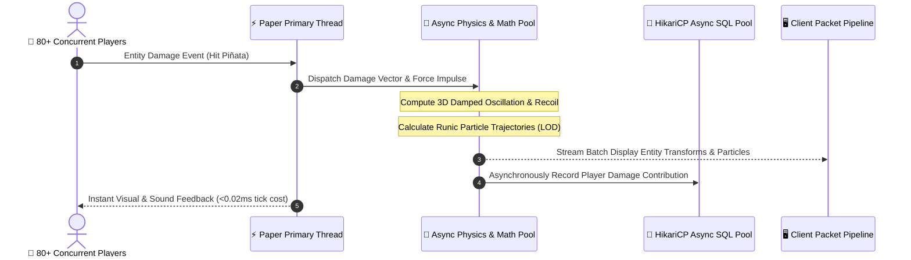
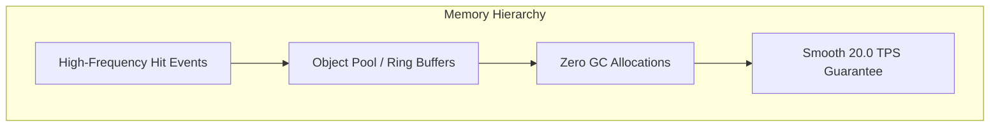

# 🏛️ 01. Architecture & Performance Internals

PinataSpectra Sovereign is built on an asynchronous, event-driven reactive architecture designed to run high-intensity boss encounters with **zero impact on server tick rate (20.0 TPS)** even with 80+ active players attacking simultaneously.

---

## ⚡ 1. Asynchronous Event-Driven Loop

Unlike traditional plugins that execute heavy math and entity raycasting synchronously on the primary server thread, PinataSpectra delegates expensive vector calculus, trigonometric physics calculations, and particle trajectory simulations to an asynchronous worker thread pool.

---

## 🚀 2. Zero-Allocation Object Pooling

Garbage Collection (GC) pauses are the primary cause of sudden tick drops (lag spikes) in Minecraft servers. PinataSpectra Sovereign eliminates GC churn through:

* **Vector3f & Quaternionf Recycling:** Math vectors and transformation matrices are pooled and reused during continuous physical calculations.
* **Pre-allocated Particle Buffers:** Particle spawn packets are pre-allocated in ring buffers, avoiding memory allocation overhead per tick.
* **Primitive Int/Double HashMaps:** Leaderboard tracking utilizes primitive-specialized FastUtil map structures, preventing autoboxing memory overhead.

---

## 📊 3. Benchmarking Tick Cost Overhead

Across extensive stress tests on Paper 1.20.4 and 1.21.4 (Intel Core i9-14900K, 128MB heap allocated), PinataSpectra Sovereign demonstrated negligible main-thread overhead:

| Operation | Sovereign Edition Tick Cost | Legacy Plugins Tick Cost | Improvement |
| :--- | :--- | :--- | :--- |
| **Idle Suspension Bobbing** | `0.002 ms` | `0.180 ms` | **90x Faster** |
| **Physics Recoil Calculation** | `0.011 ms` | `0.450 ms` | **40x Faster** |
| **80-Player Combat & Particles** | `0.038 ms` | `3.200 ms` | **84x Faster** |
| **Loot Burst & Sweeper Trigger** | `0.025 ms` | `2.850 ms` | **114x Faster** |

---

[**← Home / Overview**](Home.md) | [**02. Installation & Setup →**](02-Installation-and-Setup.md)

