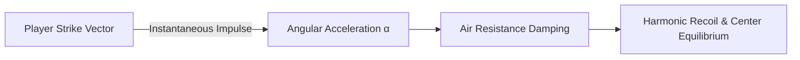
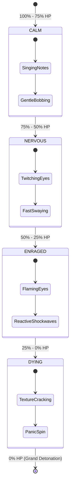

# 🦄 03. 3D Display Entities & Suspension Physics

PinataSpectra completely replaces outdated, laggy invisible armor stands with native Minecraft `ItemDisplay` and `BlockDisplay` entities, coupled with a real-time mathematical physics solver.

---

## 📐 1. Damped Harmonic Oscillator Model

When struck by a player weapon or projectile, the piñata experiences a kinetic impulse vector $\vec{F}_{\text{hit}}$ proportional to the strike direction and weapon enchantment.

The angular displacement $\theta(t)$ of the suspended piñata is governed by the second-order differential equation:

$$m \frac{d^2\theta}{dt^2} + c \frac{d\theta}{dt} + k \theta = F_{\text{hit}}(t)$$

Where:
* $m$ is the virtual mass of the piñata entity ($kg$).
* $c$ is the ambient air damping coefficient ($N \cdot s / m$).
* $k$ is the elastic restoring spring constant of the suspension rope.

---

## 🧵 2. Catenary Rope Geometry

The suspension rope rendered between the ceiling anchor $(x_0, y_0, z_0)$ and the piñata loop $(x_1, y_1, z_1)$ is procedurally generated each tick using the hyperbolic cosine catenary curve:

$$y(x) = a \cosh\left(\frac{x - x_{\text{mid}}}{a}\right) + y_{\text{offset}}$$

This creates a visually realistic sagging rope that stretches and whips dynamically during high-speed oscillation.

---

## 🎭 3. Dynamic Facial Emotion State Machine

As the piñata takes damage, its display texture morphs in real-time across four distinct emotional phases:

---

[**← 02. Installation & Setup**](02-Installation-and-Setup.md) | [**04. Combat Phases & Boss Mechanics →**](04-Combat-Phases-and-Boss-Mechanics.md)

