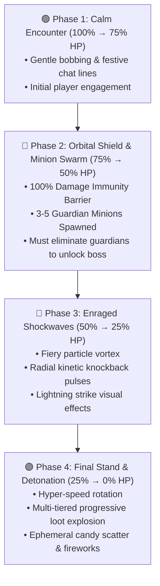

# ⚔️ 04. Combat Phases & Boss Mechanics

PinataSpectra transforms typical piñata click-fests into a multi-stage, MMO-style boss fight with escalating tactical mechanics.

---

## 🛡️ The 4 Combat Stages

---

## 🛑 Phase 2: Orbital Invulnerability Shield

During Phase 2, the piñata deploys a spherical particle shield preventing all direct damage:

> [!WARNING]
> While the shield is active, direct attacks deal **0 damage** to the boss.  
> Players must focus down the **Guardian Minions** floating around the arena. Defeating all minions shatters the shield with an acoustic glass-break sound and exposes the boss to vulnerability.

---

## 💥 Phase 3: Radial Shockwave Mechanics

In Phase 3, the boss periodically emits outward kinetic pulses:

$$v_{\text{knockback}} = \frac{K_{\text{force}}}{\max(1.0, d)} \cdot \hat{r}$$

* $d$: Distance from the player to the piñata center ($m$).
* $\hat{r}$: Unit vector pointing radially outward from the boss.
* $K_{\text{force}}$: Configurable knockback coefficient in `pinatas/*.yml`.

---

[**← 03. 3D Display Entities & Physics**](03-3D-Display-Entities-and-Physics.md) | [**05. Creating Custom Piñatas →**](05-Creating-Custom-Pinatas.md)

