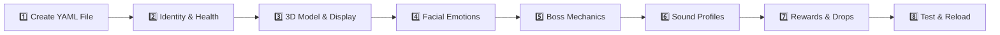

# 🛠️ 05. Creating Custom Piñatas — Master Step-by-Step Blueprint

PinataSpectra Sovereign Edition gives you total creative control to design unique, high-tier piñata bosses with custom 3D models, multi-stage boss combat mechanics, particle spell auras, and tiered loot tables.

Follow this **step-by-step guide** to create and deploy a custom Piñata from scratch.

---

## 🧭 Step-by-Step Creation Roadmap



---

## 📝 Step 1: Create the YAML Configuration File

Navigate to your server directory and open the piñatas folder:
```
plugins/PinataSpectra/pinatas/
```

Create a new file named after your boss ID in lowercase, for example: `cyber_golem.yml` or `infernal_dragon.yml`.

> [!NOTE]
> The filename without the `.yml` extension will be the **ID** you use in commands (e.g. `cyber_golem.yml` $\rightarrow$ `/pinata spawn cyber_golem`).

---

## 🏷️ Step 2: Define Core Identity, Health & Damage Caps

Open your new YAML file and establish the boss's name, total health pool, and anti-macro protection:

```yaml
# ==============================================================================
#                      1. CORE IDENTITY & COMBAT LIMITS
# ==============================================================================
id: "cyber_golem"
display_name: "<gradient:#00f0ff:#a855f7><b>CYBERNETIC TITAN PIÑATA</b></gradient>"
total_health: 600

# Anti-Macro & Auto-Clicker Defense:
# Maximum damage a single strike can deal (regardless of sharpness 1000 weapons)
damage_cap_per_hit: 5

# Minimum ticks between registered hits from the same player (20 ticks = 1 sec)
hit_cooldown_ticks: 8

# Floating BossBar displayed to nearby players in arena (radius in blocks)
boss_bar:
  enabled: true
  color: "PURPLE"          # Options: PINK, BLUE, RED, GREEN, YELLOW, PURPLE, WHITE
  style: "SEGMENTED_10"    # Options: PROGRESS, NOTCHED_6, NOTCHED_10, NOTCHED_12, NOTCHED_20
  radius: 35.0
```

---

## 🦄 Step 3: Configure the 3D Display Entity & Custom Model

PinataSpectra uses native Minecraft `ItemDisplay` entities. You can use default items, custom player heads, or custom 3D models via **ItemsAdder**, **Oraxen**, or custom Resource Packs.

```yaml
# ==============================================================================
#                      2. 3D DISPLAY ENTITY VISUALS
# ==============================================================================
model:
  # Base material holding the CustomModelData
  material: "NETHERITE_SWORD"
  custom_model_data: 10801

  # Scale vector [X, Y, Z] (1.0 = standard item size)
  scale: [2.5, 2.5, 2.5]

  # Display billboard orientation: CENTER (faces player), VERTICAL, or FIXED
  billboard: "CENTER"

  # Height offset in blocks from anchor position
  vertical_offset: 1.8
```

---

## 🎭 Step 4: Configure Real-Time Facial Emotion Morphs

As the piñata takes damage, its display texture morphs dynamically across 4 distinct emotional states:

```yaml
# ==============================================================================
#                      3. DYNAMIC EMOTION TEXTURES
# ==============================================================================
emotions:
  # Phase 1: 100% - 75% HP (Calm & Joyful)
  calm:
    custom_model_data: 10801
    ambient_particle: "NOTE"
    chat_phrases:
      - "&b[Titan] &7Is that the best you've got? Let's dance!"
      - "&b[Titan] &7Tickles! Give it your all!"

  # Phase 2: 75% - 50% HP (Nervous & Shielded)
  nervous:
    custom_model_data: 10802
    ambient_particle: "WATER_SPLASH"
    chat_phrases:
      - "&e[Titan] &7Activating defensive matrix! Minions, protect me!"

  # Phase 3: 50% - 25% HP (Enraged & Aggressive)
  enraged:
    custom_model_data: 10803
    ambient_particle: "FLAME"
    chat_phrases:
      - "&c[Titan] &4SYSTEM OVERLOAD! FEEL THE KINETIC SHOCKWAVE!"

  # Phase 4: 25% - 0% HP (Critical Overdrive)
  dying:
    custom_model_data: 10804
    ambient_particle: "SOUL_FIRE_FLAME"
    chat_phrases:
      - "&5[Titan] &dCORE FAILING... PREPARING FINAL DETONATION!"
```

---

## ⚔️ Step 5: Configure 4-Stage Combat Mechanics & Minion Waves

Turn the encounter into a tactical boss encounter with invulnerability shields, guardian minion swarms, and radial shockwaves:

```yaml
# ==============================================================================
#                      4. MULTI-STAGE BOSS MECHANICS
# ==============================================================================
combat_phases:
  # Phase 2: Orbital Shield & Guardian Minions (75% -> 50% HP)
  phase_2_shield:
    invulnerable_shield: true
    shield_particle: "ELECTRIC_SPARK"
    minion_swarm:
      enabled: true
      count: 4
      minion_health: 25
      minion_model_data: 10805
      minion_scale: [1.2, 1.2, 1.2]
      orbit_radius: 4.5
      orbit_speed: 1.5

  # Phase 3: Enraged Radial Shockwaves (50% -> 25% HP)
  phase_3_shockwave:
    interval_ticks: 120           # Every 6 seconds (120 ticks)
    knockback_force: 2.2          # Kinetic impulse multiplier
    lightning_visual: true        # Fake non-destructive lightning bolt
    sound: "ENTITY_WARDEN_SONIC_BOOM"
    particle: "SONIC_BOOM"
```

---

## 🔊 Step 6: Audio & Sound Profile Customization

Configure sound effects for every key interaction:

```yaml
# ==============================================================================
#                      5. AUDIO & SOUND PROFILE
# ==============================================================================
sounds:
  spawn: "ENTITY_WITHER_SPAWN"
  hit: "ENTITY_IRON_GOLEM_HURT"
  shield_activate: "BLOCK_BEACON_ACTIVATE"
  shield_break: "BLOCK_GLASS_BREAK"
  shockwave: "ENTITY_WARDEN_SONIC_BOOM"
  death_climax: "UI_TOAST_CHALLENGE_COMPLETE"
```

---

## 💎 Step 7: Configure MVP Rewards, Per-Hit Drops & Ephemeral Candies

Design the rewards distributed to top damage dealers, participating players, and physical drops:

```yaml
# ==============================================================================
#                      6. TIERED REWARDS & LOOT TABLES
# ==============================================================================
rewards:
  # Commands executed for Top-3 MVP damagers upon boss defeat
  top_mvp_commands:
    1: # 🥇 #1 MVP (Gold)
      - "eco give %player% 50000"
      - "crate givekey %player% cybernetic 3"
      - "broadcast &6👑 &e%player% &7dominated the &bCyber Titan &7with &c%damage% &7damage!"
    2: # 🥈 #2 Runner-Up (Silver)
      - "eco give %player% 25000"
      - "crate givekey %player% cybernetic 2"
    3: # 🥉 #3 Runner-Up (Bronze)
      - "eco give %player% 10000"
      - "crate givekey %player% cybernetic 1"

  # Rewards distributed on individual hits
  per_hit:
    chance_percent: 40
    commands:
      - "eco give %player% 150"

  # Physical item drop detonation at 0% HP (Scattered in arena)
  drop_table:
    - material: "DIAMOND"
      amount_min: 16
      amount_max: 32
      chance: 100.0
    - material: "NETHERITE_INGOT"
      amount_min: 2
      amount_max: 6
      chance: 65.0
    - material: "ENCHANTED_GOLDEN_APPLE"
      amount_min: 1
      amount_max: 3
      chance: 40.0
```

---

## 🚀 Step 8: Hot-Reload & Spawn in Server

Once your YAML file is saved, test it immediately in your server without restarting:

<!-- tabs:start -->

#### **1. Reload Plugin**
```bash
/pinata reload
```
Console will confirm:
```log
[PinataSpectra] Successfully loaded custom piñata: cyber_golem
```

#### **2. Spawn at Target Block**
Look at the floor where you want the boss suspended and execute:
```bash
/pinata spawn cyber_golem
```

#### **3. Spawn at Coordinates (Console or Scheduler)**
```bash
/pinata spawn cyber_golem world 100.5 75.0 -200.5
```
<!-- tabs:end -->

---

## 📂 Full Reference Example Templates

<!-- tabs:start -->

#### **Full Example 1: Infernal Dragon**
```yaml
id: "infernal_dragon"
display_name: "<gradient:#ff0055:#ffaa00><b>INFERNAL DRAGON PIÑATA</b></gradient>"
total_health: 500
damage_cap_per_hit: 5
hit_cooldown_ticks: 8

model:
  material: "STICK"
  custom_model_data: 10401
  scale: [2.2, 2.2, 2.2]
  billboard: "CENTER"

sound_profile:
  hit: "ENTITY_ENDER_DRAGON_HURT"
  shield_up: "BLOCK_BEACON_ACTIVATE"
  shield_break: "BLOCK_GLASS_BREAK"
  death: "ENTITY_ENDER_DRAGON_DEATH"

combat_phases:
  phase_2_minions:
    count: 4
    minion_health: 30
    minion_model_data: 10402
  phase_3_shockwave:
    interval_ticks: 100
    knockback_force: 2.5
    particle: "FLAME"

rewards:
  top_mvp_commands:
    1:
      - "eco give %player% 50000"
      - "crate givekey %player% mythical 3"
      - "broadcast &6%player% achieved #1 MVP on Infernal Dragon!"
    2:
      - "eco give %player% 25000"
      - "crate givekey %player% mythical 1"
    3:
      - "eco give %player% 10000"
  per_hit:
    chance_percent: 45
    commands:
      - "eco give %player% 250"
```

#### **Full Example 2: Cosmic Unicorn**
```yaml
id: "cosmic_unicorn"
display_name: "<gradient:#a855f7:#00f0ff><b>COSMIC UNICORN PIÑATA</b></gradient>"
total_health: 350
damage_cap_per_hit: 4
hit_cooldown_ticks: 10

model:
  material: "FEATHER"
  custom_model_data: 20101
  scale: [1.8, 1.8, 1.8]
  billboard: "VERTICAL"

sound_profile:
  hit: "ENTITY_ALLAY_HURT"
  shield_up: "BLOCK_AMETHYST_BLOCK_CHIME"
  shield_break: "BLOCK_AMETHYST_CLUSTER_BREAK"
  death: "UI_TOAST_CHALLENGE_COMPLETE"

combat_phases:
  phase_2_minions:
    count: 3
    minion_health: 20
    minion_model_data: 20102
  phase_3_shockwave:
    interval_ticks: 120
    knockback_force: 1.8
    particle: "END_ROD"

rewards:
  top_mvp_commands:
    1:
      - "eco give %player% 30000"
      - "crate givekey %player% cosmic 2"
```
<!-- tabs:end -->

---

<div align="space-between">

[**← 04. Combat Phases & Boss Mechanics**](04-Combat-Phases-and-Boss-Mechanics.md) | [**06. Particle LOD & Runic Circles →**](06-Particle-LOD-and-Runic-Circles.md)

</div>