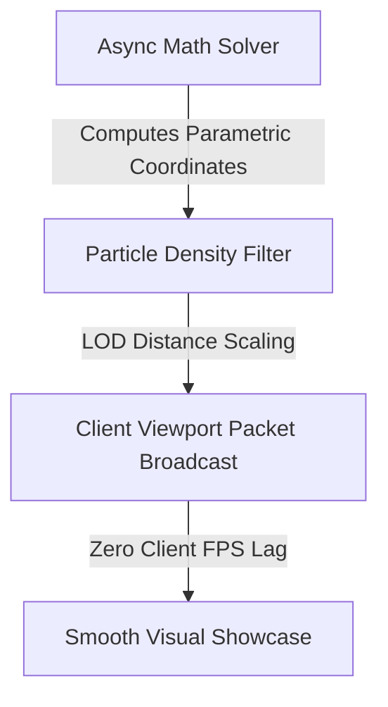

# 🔮 06. Particle LOD & Runic Circles

PinataSpectra features a mathematical particle animation engine capable of generating complex geometric circles, spiraling vortices, and runic glyphs while safeguarding server and client performance through dynamic **Level of Detail (LOD)** algorithms.

---

## 📐 1. Parametric Geometry Formulas

Visual effects in PinataSpectra are rendered via parametric mathematical equations computed asynchronously:

### Archimedean Spell Spiral
$$r(\theta) = a + b\theta, \quad x = r\cos\theta, \quad z = r\sin\theta, \quad y = y_0 + c\theta$$

### Multi-Petal Runic Hypocycloid
$$x(t) = (R - r)\cos(t) + d\cos\left(\frac{R - r}{r} t\right)$$
$$z(t) = (R - r)\sin(t) - d\sin\left(\frac{R - r}{r} t\right)$$

---

## 👁️ 2. Dynamic LOD (Level of Detail) Scaling

To ensure players on lower-end PCs or mobile (via GeyserMC) maintain 60+ FPS, particle density is scaled dynamically based on player distance $d$:

$$\text{Density}(d) = \text{BaseDensity} \cdot \max\left(0.15, 1.0 - \frac{d}{R_{\text{cull}}}\right)$$

* **Close Range ($0 \le d \le 8$m):** 100% full resolution runic circles and continuous rope catenary particles.
* **Medium Range ($8 < d \le 24$m):** 50% particle decimation; retains primary structural shapes.
* **Far Range ($24 < d \le 48$m):** 20% particle decimation; basic aura indicator.
* **Beyond Cull Radius ($d > 48$m):** 0% packets sent (Zero network/client overhead).

---

[**← 05. Creating Custom Piñatas**](05-Creating-Custom-Pinatas.md) | [**07. Ephemeral Candies & Sweeper →**](07-Ephemeral-Candies-and-Sweeper.md)

