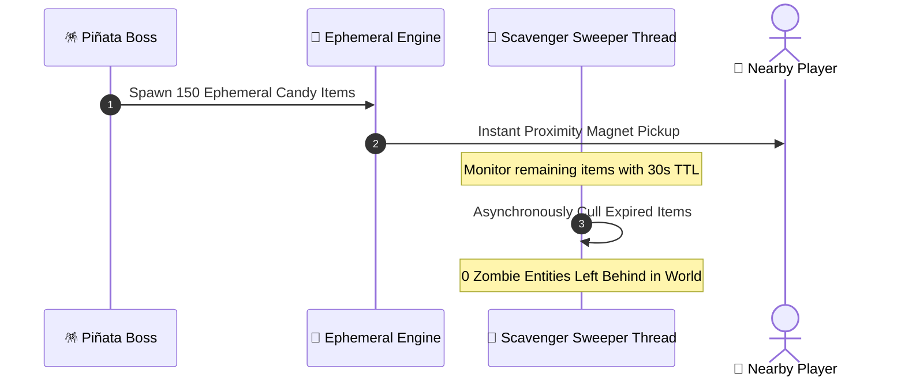

# 🍬 07. Ephemeral Candies & Auto-Sweeper

When piñatas are struck or defeated, they drop festive, floating items ("Candies"). In poorly coded plugins, dropping hundreds of physical items leads to severe server tick drops and entity bloat. PinataSpectra solves this with the **Ephemeral Candy Engine**.

---

## 🛡️ 1. Instant-Pickup Ephemeral Candies

* **Persistent Data Container (PDC) Tags:** Candies are stamped with a proprietary NBT marker (`SpectraCandyUUID`).
* **Zero Collision Lag:** Candies bypass standard vanilla entity pickup delay (0 tick cooldown), granting immediate rewards upon player proximity.
* **Anti-Dupe & Inventory Safety:** Handled atomically in memory; items that cannot fit into full player inventories are safely converted into virtual balance or bank credits.

---

## 🧹 2. Scavenger Garbage Collector

The built-in sweeper thread runs every 10 ticks in the background:
1. Scans world chunks containing active or recently concluded piñata events.
2. Identifies all dropped items tagged with `SpectraCandyUUID`.
3. If an item exceeds its Time-To-Live (default: 30 seconds), it is gracefully despawned with a small poof particle.
4. Guaranteed zero entity leakage even if the server crashes or chunks are abruptly unloaded.

---

[**← 06. Particle LOD & Runic Circles**](06-Particle-LOD-and-Runic-Circles.md) | [**08. Leaderboards GUI & Stats →**](08-Leaderboards-GUI-and-Stats.md)

