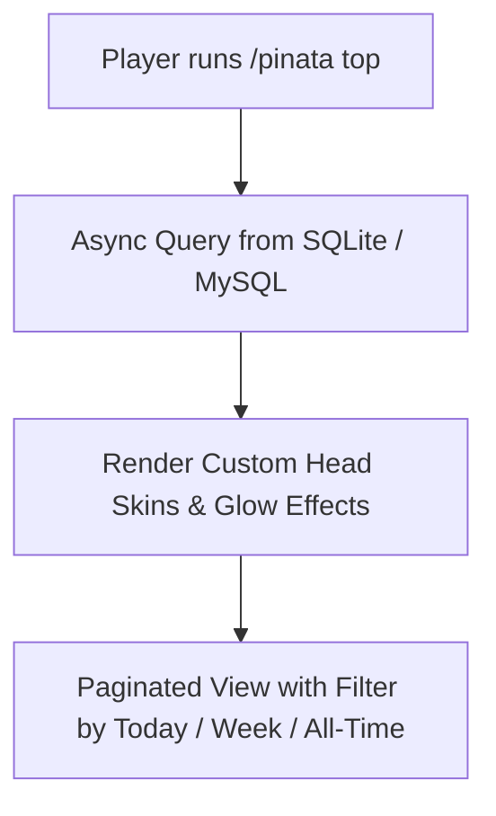

# 🏆 08. Leaderboards GUI & Statistics

PinataSpectra Sovereign records player combat interactions in real time, calculating proportional damage, hit frequency, and MVP standings across events.

---

## 📊 1. Proportional Reward Distribution

Rewards are distributed using tiered contribution algorithms:

$$\text{PlayerShare} = \frac{\text{DamageDealt}_{\text{player}}}{\text{TotalDamage}_{\text{boss}}}$$

* **#1 MVP (Gold Tier):** Receives exclusive mythic keys, top broadcast announcement, and primary loot multipliers.
* **#2 & #3 Runner-Up (Silver/Bronze Tier):** Substantial economy rewards and crate keys.
* **Participation Pool:** All players dealing $\ge 1\%$ damage receive participation candies and community tokens.

---

## 🖥️ 2. Interactive Paginated Chest GUI (`/pinata top`)

Players can open a sleek, glassmorphic chest inventory to view recent event winners, all-time damage leaderboards, and personal statistics.

* Fully customizable item slots, sounds, and decorative glass borders via `gui.yml`.
* Supports MiniMessage gradients and interactive click actions.

---

[**← 07. Ephemeral Candies & Sweeper**](07-Ephemeral-Candies-and-Sweeper.md) | [**09. Auto-Scheduler & Vote Party →**](09-Auto-Scheduler-and-Vote-Party.md)

