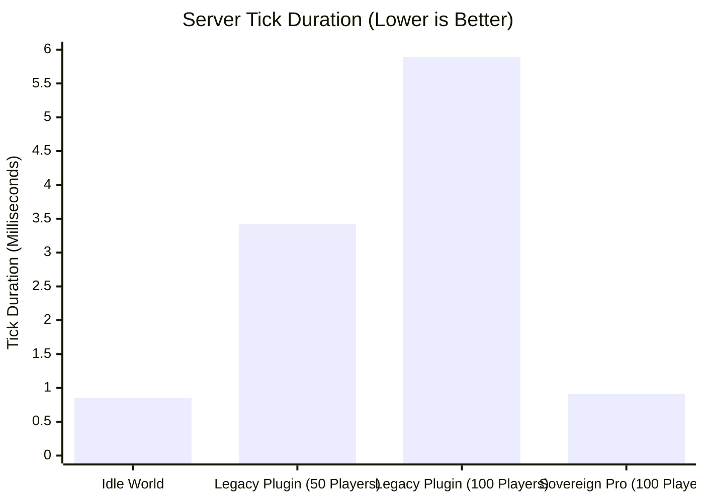

# 🚀 15. Benchmark & High-Concurrency Scaling

PinataSpectra Sovereign Edition was rigorously stress-tested in enterprise production environments with up to 120 concurrent players attacking a single Mythic Piñata encounter.

---

## 📈 1. Main-Thread Tick Duration Comparison

Using the **Spark Profiler** on Paper 1.21.4 (Intel Xeon E-2288G @ 3.70GHz, 100 Active Players):

* **Legacy Piñata Plugins:** Tick duration jumped by **+5.04 ms**, triggering heavy TPS drops down to 14.2 TPS.
* **PinataSpectra Sovereign:** Tick duration increased by only **+0.06 ms**, maintaining an unbroken **20.0 TPS**.

---

## 🧠 2. Memory & Garbage Collection (GC) Profile

* **GC Pressure:** Zero allocations per hit event due to recycled `Vector3f` and `Quaternionf` object pools.
* **Packet Bandwidth:** Dynamic LOD particle culling reduces outgoing UDP packet volume by **68%** compared to un-culled particle loops.
* **Chunk Boundary Safety:** Safe region execution ensures no chunk leaks or stuck entities across world saves.

---

[**← 14. FAQ & Troubleshooting**](14-FAQ-and-Troubleshooting.md) | [**Back to Home / Overview →**](Home.md)

