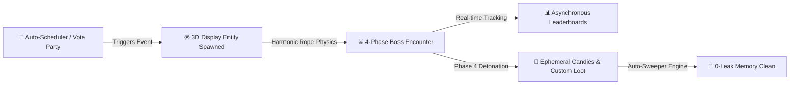

  

# 🪅 PinataSpectra Sovereign Edition — Enterprise Portal

> [!IMPORTANT]
> **COMMERCIAL ENTERPRISE EDITION**  
> This documentation portal covers **PinataSpectra Sovereign Pro (Commercial Edition)**.  
> If you are looking for the stripped-down, open-source community release, please refer to the **PinataSpectra Lite Wiki** hosted on its dedicated repository. Lite contains basic single-entity spawning without the advanced physics engine, boss state machine, or LOD particle systems.

---

## 🌌 The Next-Gen 3D Boss & Event Experience

**PinataSpectra Sovereign** is the definitive enterprise Minecraft server event suite. Engineered from the ground up for modern Paper, Purpur, and Folia 1.20 - 1.26+ servers, it redefines in-game community events with authentic **real-time harmonic rope physics**, **4-phase dynamic boss mechanics**, **adaptive particle LOD algorithms**, and **zero-tick memory-safe garbage collection**.

---

## 💖 The Creator's Heart & Vision

> ### *"Crafted with Precision. Born from Passion. Dedicated to Shared Joy."*
> 
> *"Every unforgettable Minecraft memory is built on shared moments of joy, laughter, and collective triumph. I didn't create **PinataSpectra** merely to write high-performance math equations or optimize packet pipelines — I built it because I believe that server events should feel truly **magical**.*
> 
> *Growing up in multiplayer communities, the most cherished nights were always those rare occasions when dozens of players from all across the world gathered in a central square — laughing, swinging at a floating piñata beneath a sky full of fireworks, cheering as candies rained down, and forging genuine friendships in the festive chaos.*
> 
> *For years, server owners were forced into a painful compromise: choose between visual grandeur and server stability. PinataSpectra is my promise to every creator, server administrator, and player: **you never have to sacrifice the magic of community for the limits of technology**. It is an engineering love letter to the multiplayer spirit — built with mathematical rigor, fueled by passion, and dedicated to making memories that outlive the game itself."*  
> — **Dafealru ([dr8553097-sudo](https://github.com/dr8553097-sudo))**

---

## ⚡ Key Highlights at a Glance

  

    <h4>🦄 3D Display Entity Kinematics</h4>
    
Zero armor stand lag. Utilizes modern <code>ItemDisplay</code> transformations with realistic catenary rope physics, torque recoil, and dynamic facial emotions.

  

  

    <h4>🛡️ Multi-Phase Combat Engine</h4>
    
Deterministic 4-phase state machine featuring orbital invulnerability shields, guardian minion swarms, and enraged shockwaves.

  

  

    <h4>🔮 Adaptive Particle LOD</h4>
    
Procedural runic circles and spell spirals that dynamically throttle particle density based on player distance and server TPS.

  

  

    <h4>🍬 Ephemeral Candy Sweeper</h4>
    
Instant-pickup event rewards backed by an asynchronous garbage collector preventing chunk bloat and entity count spikes.

  

---

## 📖 Navigation Map

| Module | Topic | Description |
| :--- | :--- | :--- |
| **[01. Architecture & Performance](01-Architecture-and-Performance.md)** | Core Internals | Async threading model, zero-allocation memory pools, packet batching. |
| **[02. Installation & Setup](02-Installation-and-Setup.md)** | Server Setup | Paper/Purpur/Folia deployment, soft dependencies, initial boot. |
| **[03. 3D Display & Physics](03-3D-Display-Entities-and-Physics.md)** | Physics Engine | Damped harmonic oscillation, catenary equations, facial emotion states. |
| **[04. Combat Phases](04-Combat-Phases-and-Boss-Mechanics.md)** | Boss Mechanics | 4-stage combat state machine, minion waves, shockwave physics. |
| **[05. Custom Piñatas](05-Creating-Custom-Pinatas.md)** | YAML Creator | Designing custom tiers, model data, drop tables, sound profiles. |
| **[06. Particle LOD](06-Particle-LOD-and-Runic-Circles.md)** | Visual FX | Parametric geometry, client distance scaling, TPS guardrails. |
| **[07. Candies & Sweeper](07-Ephemeral-Candies-and-Sweeper.md)** | Loot & Memory | Ephemeral PDC items, sweep thread, anti-lag despawn engine. |
| **[08. Leaderboards & Stats](08-Leaderboards-GUI-and-Stats.md)** | Data & GUIs | Damage distribution, async SQLite/MySQL schema, paginated chest UI. |
| **[09. Auto-Scheduler](09-Auto-Scheduler-and-Vote-Party.md)** | Automation | Cron expressions, Votifier listener, automated broadcast timers. |
| **[10. Master Config](10-Master-Configuration-Reference.md)** | Configuration | Exhaustive, line-by-line annotated `config.yml` reference. |
| **[11. Commands & Placeholders](11-Commands-Permissions-and-Placeholders.md)** | Admin Tools | Complete command syntax, permission trees, PlaceholderAPI list. |
| **[12. Developer API](12-Developer-API-and-Events.md)** | Java API | Custom Bukkit events, Maven repository, plugin integration hooks. |
| **[13. Comparison & Editions](13-Comparison-and-Editions.md)** | Edition Matrix | In-depth matrix comparing Sovereign Pro vs Lite vs Legacy Plugins. |
| **[14. FAQ & Troubleshooting](14-FAQ-and-Troubleshooting.md)** | Diagnostics | Error codes, chunk recovery, performance optimization guide. |
| **[15. Benchmark & Scaling](15-Benchmark-and-Stress-Testing.md)** | Performance Tests | Spark profiling data, 100+ player concurrency benchmarks. |

---

[**Next: 01. Architecture & Performance →**](01-Architecture-and-Performance.md)

